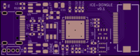
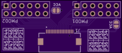
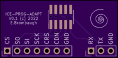

# ice-dongle Hardware
These are kicad projects for the ice-dongle board.

## ice-dongle: the main board design for the ice-dongle

## ice-fpc-pmod: a simple FPC to dual PMOD breakout board. Note that this can be
used for both FPC -> PMOD socket as well as PMOD pin header -> FPC just by
flipping the board upside down.

## ice-prog-adapt: breaks out the 10-pin 1.27mm IDC header to 2.54mm single-row
pins for connection to a programmer and UART.

