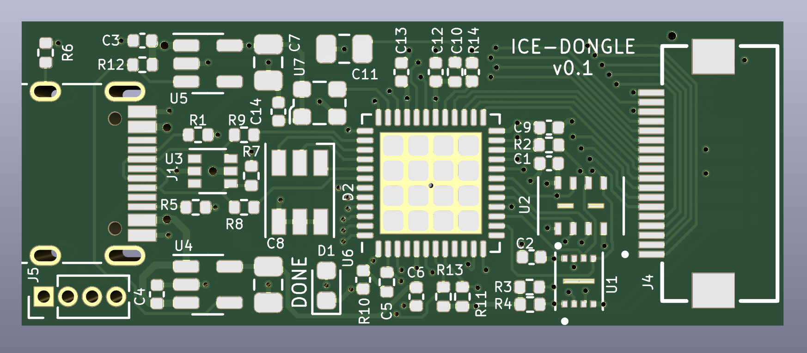

# ice-dongle
USB-C Dongle with ice40 UP5k FPGA

## Abstract
This is a small USB connected FPGA board in a "dongle" form-factor. Note that
it's not a true dongle since it doesn't have a USB plug (USB-C plugs are not
practical for DIY assembly at the time this was designed) - instead it has a
USB-C jack and you can use an inexpensive M-M adapter to achieve dongle-like
function.

For I/O it provides an 18-pin FPC connector that conforms to the Eye-SPI
standard found on some Adafruit products. This standard includes 3.3V power
as well as 16 GPIO for things like SPI or I2C device, most often TFT LCD
displays and user interfaces.

The FPGA is directly connected to USB and is pinned-out similarly to the
1bitsquared Icebreaker Bitsy so the NO2FPGA bootloader and user designs for
that ecosystem should port over with minimal changes. It includes 8MB of flash
and 8MB of PSRAM, as well as an RGB LED and a user button.

Initial programming of the FPGA bitstream takes place through a 1.27mm SMD
header footprint on the back of the board. The recommended way to access this
is via the Adafruit "Pogo Pin Probe Clip" which should attach easily over
the pads.

