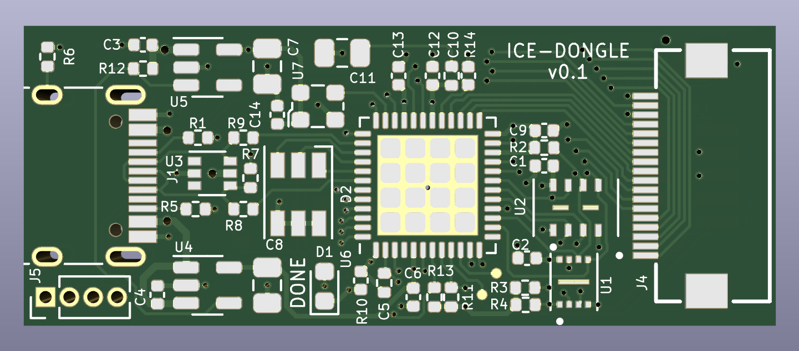
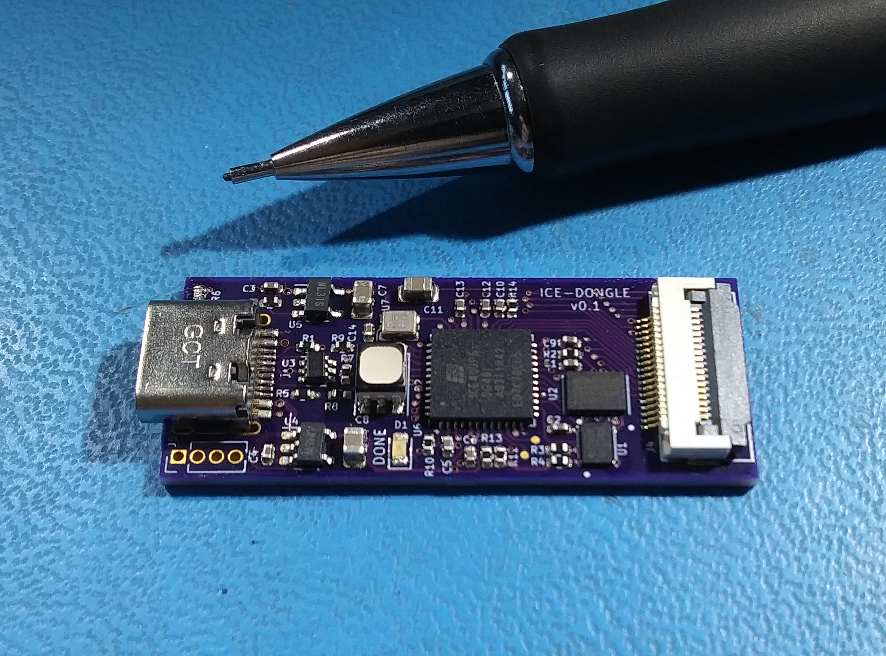

# ice-dongle
USB-C Dongle with ice40 UP5k FPGA

## Abstract
This is a small USB connected FPGA board in a "dongle" form-factor. Note that
it's not a true dongle since it doesn't have a USB plug (USB-C plugs are not
practical for DIY assembly at the time this was designed) - instead it has a
USB-C jack and you can use an inexpensive M-M adapter to achieve dongle-like
function.

For I/O it provides an 18-pin FPC connector that conforms to the Eye-SPI
standard found on some Adafruit products. This standard includes 3.3V power
as well as 16 GPIO for things like SPI or I2C device, most often TFT LCD
displays and user interfaces.

The FPGA is directly connected to USB and is pinned-out similarly to the
1bitsquared Icebreaker Bitsy so the NO2FPGA bootloader and user designs for
that ecosystem should port over with minimal changes. It includes 8MB of flash
and 8MB of PSRAM, as well as an RGB LED and a user button.

Initial programming of the FPGA bitstream takes place through a 1.27mm SMD
header footprint on the back of the board. The original intent was to access
this temporarily via the Adafruit "Pogo Pin Probe Clip" which should have
attached easily over the pads. Unfortunately the pogo pin row spacing is too
narrow for the SMT header pads so I ended up soldering on a header and using
a normal cable. This may be fixed in future revisions, but for now an actual
header + cable is probably more reliable for long-term development.

## Status
### 22-10-15
Boards are back from OSHpark and so far things are working.
* USB power, regulators and clock oscillator are running properly.
  * Minor silkscreen error was discovered - reference designators for R14 and C10 swapped.
* FPGA configures via programming header and from SPI flash.
* SPI flash can be written from the programming header.
* RGB LED works.
* EYESPI bus works with ST7789 TFT LCD
* PSRAM works.

### 22-10-16
USB FS interface is fully functional with the NO2 Bootloader. I've forked it to
add a custom BOARD target for ice-dongle but I'll submit a PR to the main project
when things settle down a bit. For the time being here's my fork:

[NO2 Bootloader](https://github.com/emeb/no2bootloader)

To build, clone that and follow the directions in the README. A few additional
notes:
* Don't forget to `git submodule update --init` to get all the related material
from the NO2 ecosystem.
* To build use `make BOARD=ice-dongle bootloader`
* The `riscv_lcd` gateware project has a `make dfu` target that shows how to use
the bootloader.

### 22-10-17
Ordered some helper boards to make interfacing easier:
* ice-fpc-pmod
* ice-prog-adapt

find out more about them in the [Hardware](Hardware) directory.

### 22-11-20
* Sylvain Munaut (@tnt) has built up a couple ice-dongle boards and confirmed that
they work outside my lab. He did spot another silkscreen error - R10 and C5 reference
designators are swapped. This doesn't significantly affect the board operation but
should be corrected.
* Updated NO2 board definition to put serial pins on programming
header and sent a PR which has been accepted. You can now use the mainline
NO2 bootloader repo instead of my fork.
* Added a LiteX gateware design. This works but even a minimal demo uses > 80% of
the FPGA resources.

### 22-11-21
Corrected silkscreen errors and bumped revision to V0.1a
